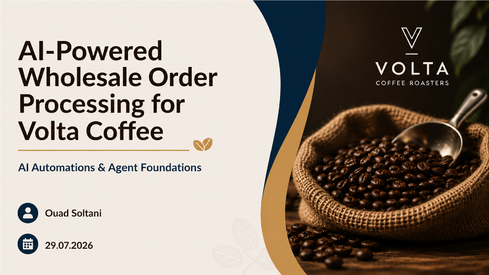
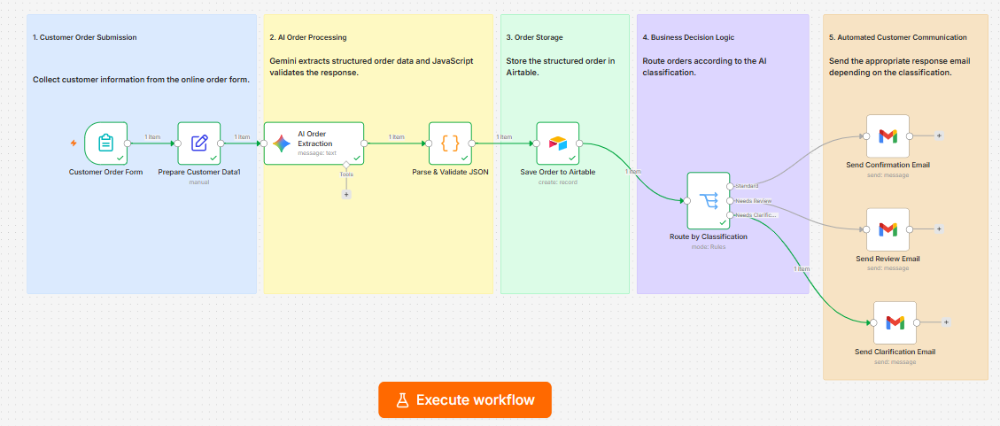
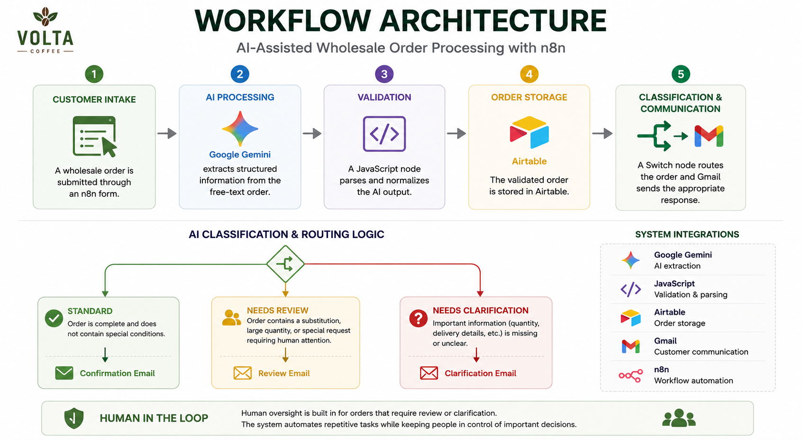
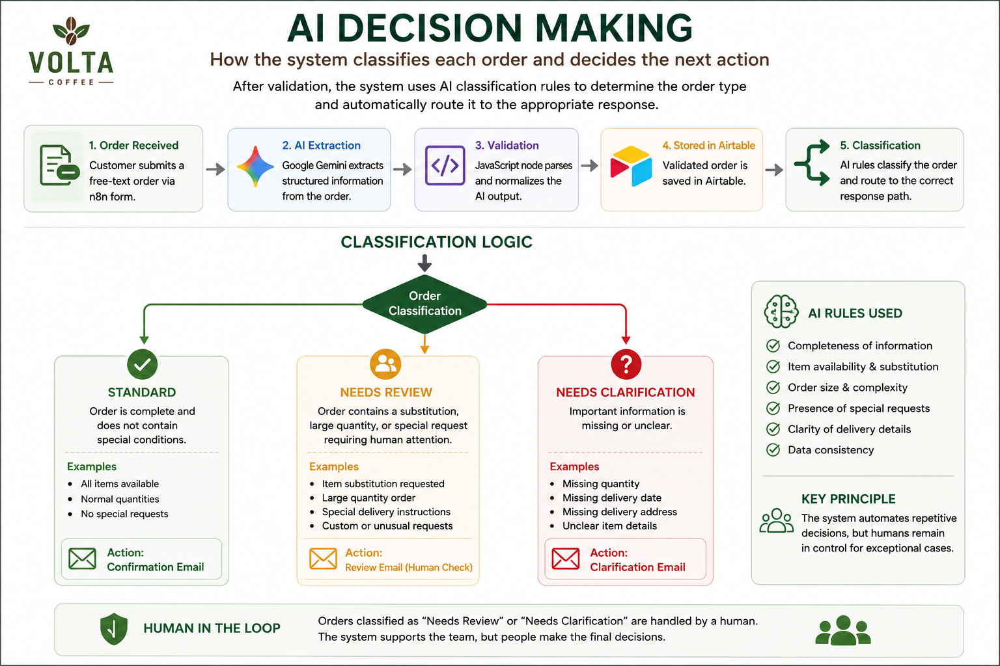
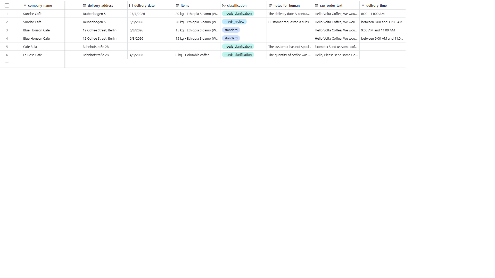
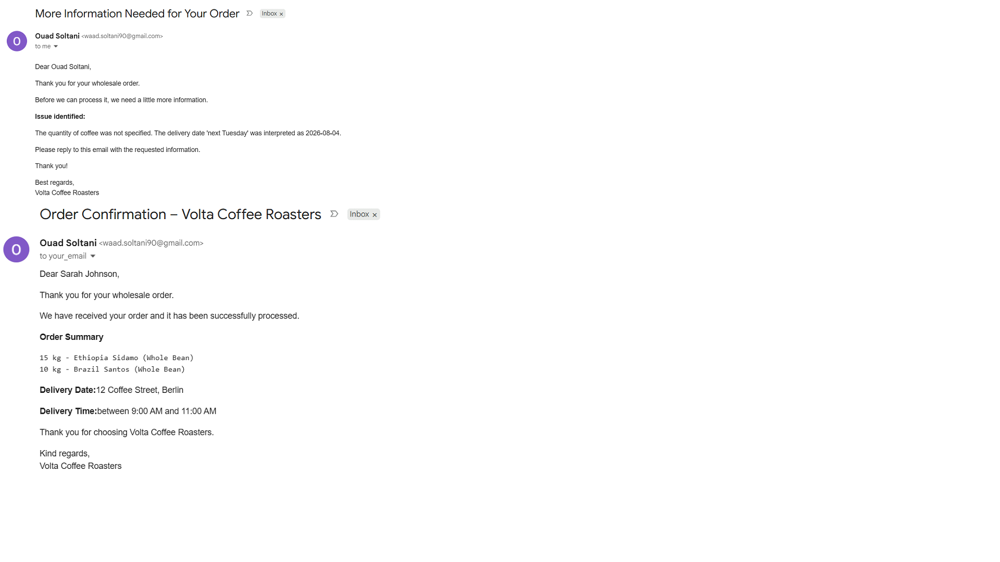
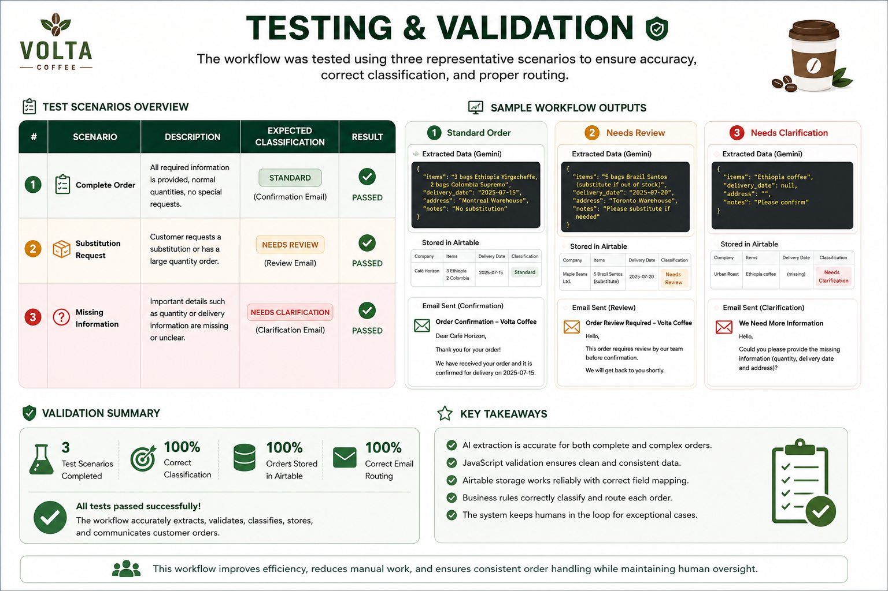

# ☕ Volta Coffee – AI Wholesale Order Processing




AI-assisted wholesale order processing workflow built with **n8n**, **Google Gemini**, **JavaScript**, **Airtable**, and **Gmail**.

This project demonstrates how Artificial Intelligence can automate the repetitive processing of wholesale coffee orders while keeping humans responsible for business-critical decisions.

Customers submit free-text orders through an online form. Google Gemini extracts structured information, JavaScript validates the response, Airtable stores the order, and n8n automatically sends the appropriate customer email based on the order classification.

---

# 🚀 Workflow Overview



The workflow consists of five stages:

1. Customer Intake
2. AI Processing
3. Validation
4. Order Storage
5. Classification & Customer Communication

---

# 📌 Business Problem

Wholesale orders are often received as long, unstructured messages.

Employees must manually:

- Read every order
- Extract important information
- Enter data into internal systems
- Decide how the order should be handled
- Send the appropriate response

This process is repetitive, slow, and prone to mistakes.


---

# 💡 Solution Architecture

The proposed solution combines AI with workflow automation.

Google Gemini extracts structured information from free-text orders.

A JavaScript node validates and standardizes the AI output before the workflow stores the order in Airtable.

Finally, business rules determine the correct customer response.



---

# 🤖 AI Decision Making

Instead of making business decisions autonomously, AI performs the first assessment and routes the order according to predefined business rules.

Orders are classified into three categories:

- ✅ Standard
- 🟡 Needs Review
- 🔴 Needs Clarification



Human intervention is required whenever an order needs review or clarification.

---

# 🗂 Airtable Integration

Every validated order is automatically stored in Airtable.

The database keeps a structured record of:

- Customer information
- Ordered products
- Delivery details
- AI classification
- Notes for human review
- Original customer message



---

# 📧 Automated Customer Communication

Depending on the classification, the workflow automatically sends one of three email templates.

- Order Confirmation
- Review Notification
- Clarification Request

This ensures fast, consistent communication while keeping humans in control whenever necessary.



---

# ✅ Testing & Validation

The workflow was tested using three representative scenarios.

- Complete order
- Order requiring review
- Order requiring clarification

All scenarios produced the expected classification and the correct customer response.



### Validation Summary

- ✅ Correct AI extraction
- ✅ Valid JSON output
- ✅ Successful Airtable storage
- ✅ Correct order classification
- ✅ Correct email routing
- ✅ Human-in-the-loop maintained

---

# ⚙ Technologies Used

- n8n
- Google Gemini
- JavaScript
- Airtable
- Gmail API
- Markdown
- GitHub

---

# 📂 Repository Structure

```text
volta-coffee-ai-order-processing/
│
├── assets/
│   ├── workflow_n8n.png
│   ├── business_problem.png
│   ├── workflow_architecture.png
│   ├── ai_decision_making.png
│   ├── airtable_orders.png
│   ├── email_confirmation.png
│   └── testing_validation.png
│
├── workflow/
│   └── volta_coffee_ai_order_processing.json
│
├── documentation/
│   ├── Project_Summary.pdf
│   ├── Testing_Report.pdf
│   └── Appendix.pdf
│
├── presentation/
│   ├── Presentation.pdf
│   └── Presentation.pptx
│
├── README.md
└── LICENSE
```

---

# 🔮 Future Improvements

Possible future enhancements include:

- Slack notifications
- Inventory availability checks
- ERP integration
- CRM integration
- Automatic invoice generation
- Dashboard and analytics
- AI confidence score
- Multi-language customer support

---

# ▶️ Running the Workflow

1. Import the JSON workflow into n8n.
2. Configure Google Gemini credentials.
3. Connect Airtable.
4. Configure Gmail OAuth.
5. Execute the workflow using the customer order form.

---

# 👤 Author

**Dr. Ouad Soltani**

PhD in Plant Biology

Data Analytics & Artificial Intelligence Program

Masterschool Institute of Technology

---

⭐ *Developed as part of the **AI Automations & Agent Foundations** course to demonstrate practical AI workflow automation using n8n.*
